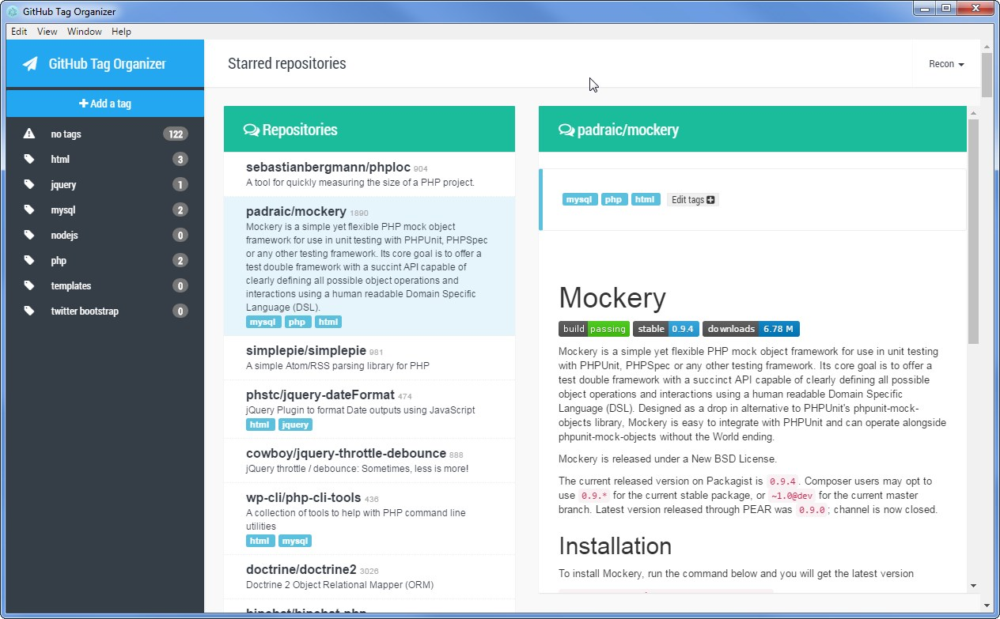

# GitHub tags for starred repositories
 
### About

This is a prototype [electron](http://electron.atom.io/) application which will allow you to view a list of your starred 
repositories and organize them using custom tags.

It uses [IndexedDB](https://developer.mozilla.org/en-US/docs/Web/API/IndexedDB_API) to store information locally about 
the starred repositories, and synchronizes (max. 1 times per hour) via GitHub oAuth. 

It's an experimental project, built for the sole purpose of getting accustomed with NodeJS/Electron environment and 
some HTML5 features.

The interface is based on the [Flat FlatAdmin v2](http://tui2tone.github.io/flat-admin-bootstrap-templates/html/pages/)
bootstrap template, modified accordingly.

This project is hosted on [GitLab](https://gitlab.com/corneliupr/github-tags-starred-repositories) and mirrored on 
GitHub.

### Installation

- Copy "config.example.json" to "config.json" and update your application keys (will be replaced with a proper dialog 
and instructions to create a github application)
- Run "npm install"
- Run "npm start"

### @ToDo
- Ask for oAuth keys in a dialog, to avoid using a config file

